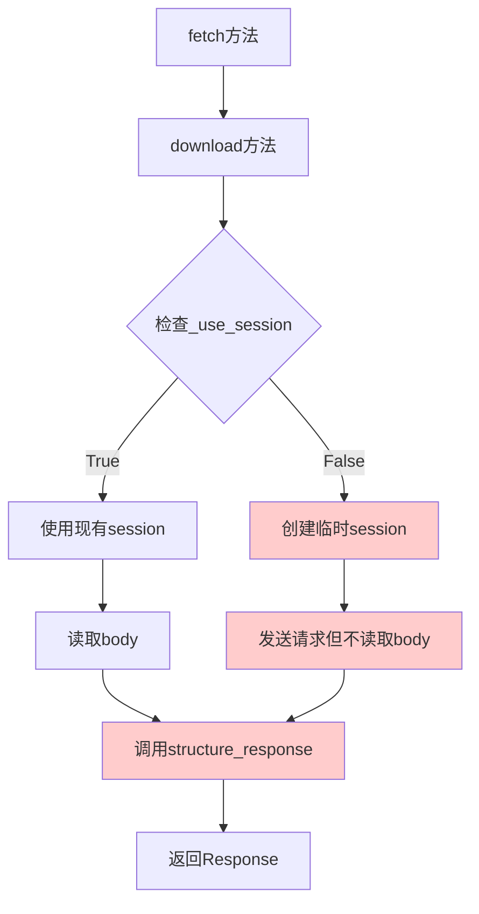

# Design Document

## Introduction

本设计文档旨在修复 bald_spider 框架中 downloader.py 模块的运行错误问题。通过详细分析代码逻辑和错误原因，设计出完整的解决方案。

## Architecture Overview

### Current Architecture Issues



### Root Cause Analysis

1. **download 方法逻辑缺陷**：
   - else 分支中缺少 `body = await response.content.read()`
   - 导致 `structure_response` 调用时 `body` 变量未定义

2. **配置项问题**：
   - `_use_session` 使用了错误的配置项名 `"_use_session"`
   - 应该使用合理的默认值或正确的配置项

3. **参数传递问题**：
   - `proxy` 参数语法错误
   - `@staticmethod` 方法的参数传递问题

## Technical Design

### 1. Download Method Logic修复

#### 当前问题：
```python
async def download(self, request) -> Response | None:
    try:
        if self._use_session:
            response = await self.send_request(self.session, request)
            body = await response.content.read()  # 只在if分支中读取
        else:
            # 创建临时session但不读取body
            async with ClientSession(...) as session:
                response = await self.send_request(session, request)
                # 缺少: body = await response.content.read()
    except Exception as e:
        return e
    return self.structure_response(request, response, body)  # body可能未定义
```

#### 修复方案：
```python
async def download(self, request) -> Response | None:
    try:
        if self._use_session and self.session:
            response = await self.send_request(self.session, request)
            body = await response.content.read()
        else:
            connector = TCPConnector(verify_ssl=self._verify_ssl)
            tace_config = TraceConfig()
            tace_config.on_request_start.append(self.request_start)
            async with ClientSession(
                connector=connector, timeout=self._timeout, trace_configs=[tace_config]
            ) as session:
                response = await self.send_request(session, request)
                body = await response.content.read()  # 添加这行
    except Exception as e:
        self.logger.error(f"Error during request: {e}")
        return e
    return self.structure_response(request, response, body)
```

### 2. 配置项和初始化修复

#### 当前问题：
```python
# 第42行
self._use_session: bool | None = None

# 第54行  
self._use_session = self.crawler.settings.getbool("_use_session")  # 错误的配置项名
```

#### 修复方案：
```python
# 修改第42行
self._use_session: bool = True  # 设置合理的默认值

# 修改第54行
# 移除错误的配置项读取，直接使用默认值或提供合理的判断逻辑
# 或者使用正确的配置项名，如 "USE_SESSION"
```

### 3. HTTP 请求参数修复

#### 当前问题：
```python
# _get 和 _post 方法中的 proxy 参数语法错误
response = await session.get(
    request.url,
    headers=request.headers,
    cookies=request.cookie,
    proxy=request.proxy,  # 错误：aiohttp不支持这个参数格式
)
```

#### 修复方案：
```python
# 修复 proxy 参数语法
proxy = request.proxy
proxy_str = None
if proxy:
    if isinstance(proxy, str):
        proxy_str = proxy
    elif isinstance(proxy, dict) and 'http' in proxy:
        proxy_str = proxy['http']

response = await session.get(
    request.url,
    headers=request.headers,
    cookies=request.cookie,
    proxy=proxy_str,  # 使用正确的格式
)
```

### 4. 方法签名修复

#### 当前问题：
```python
# send_request 方法调用静态方法时参数传递错误
async def send_request(self, session, request) -> ClientResponse:
    return await self.request_method[request.method.lower()](session, request)

@staticmethod
async def _get(session, request) -> ClientResponse:  # 静态方法不需要self
```

#### 修复方案：
```python
# 方案1：移除 @staticmethod 装饰器
async def _get(self, session, request) -> ClientResponse:
    response = await session.get(...)
    return response

# 或方案2：修改调用方式
async def send_request(self, session, request) -> ClientResponse:
    method_name = request.method.lower()
    if method_name == "get":
        return await self._get(session, request)
    elif method_name == "post":
        return await self._post(session, request)
```

## Implementation Plan

### Phase 1: 核心逻辑修复
1. 修复 download 方法中的 body 读取逻辑
2. 确保两个分支都正确读取响应体
3. 修复配置项初始化

### Phase 2: 参数处理修复  
1. 修复 proxy 参数的语法
2. 修复静态方法的调用问题
3. 确保所有 HTTP 请求参数正确

### Phase 3: 错误处理和资源管理
1. 改进异常处理逻辑
2. 确保资源正确清理
3. 添加适当的日志记录

## Boundary Cases

| 场景 | 当前行为 | 修复后行为 | 处理位置 |
|------|----------|------------|----------|
| _use_session 为 None | 进入 else 分支，body 未定义 | 进入 else 分支，正确读取 body | download 方法 |
| 临时 session 异常 | 可能资源泄漏 | 正确的上下文管理器处理 | download 方法 |
| proxy 参数格式错误 | HTTP 请求失败 | 正确转换 proxy 格式 | _get/_post 方法 |
| 请求方法不是 GET/POST | KeyError | 返回适当的错误 | send_request 方法 |
| 响应体读取失败 | 可能返回 None | 捕获异常并返回错误 | download 方法 |

## Testing Strategy

### Unit Tests
1. 测试 download 方法的两个分支
2. 测试不同配置项组合
3. 测试异常情况处理
4. 测试资源清理

### Integration Tests  
1. 运行完整的爬虫流程
2. 验证 debug 日志输出
3. 确认并发数显示正确
4. 验证资源泄漏警告消除

## Performance Considerations

1. **资源管理**：确保临时 session 正确关闭
2. **异常处理**：避免异常导致的资源泄漏
3. **配置检查**：避免重复的配置项检查
4. **方法调用**：优化静态方法调用性能

## Migration Path

1. **向后兼容**：保持现有的 API 接口不变
2. **配置兼容**：支持现有的配置项
3. **渐进式修复**：分阶段修复，避免大规模重构
4. **测试验证**：每个阶段都有相应的测试验证